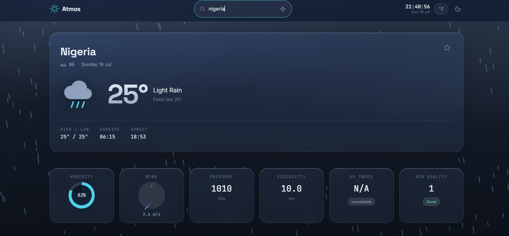
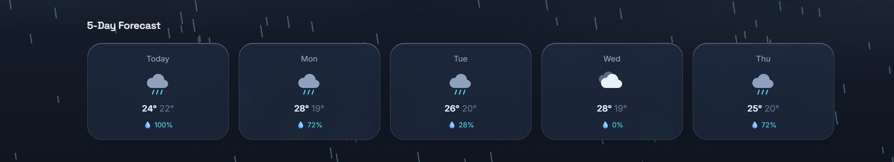
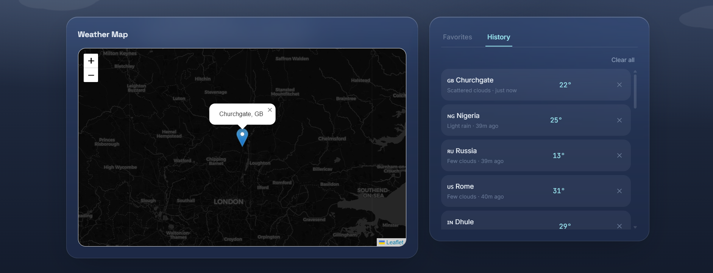

# 🌦️ Atmos — Full Stack Weather Dashboard

A modern **Full Stack Weather Dashboard** built with **HTML5, CSS3, JavaScript, Node.js, Express.js, MongoDB, and OpenWeather API**.

The application provides **real-time weather information**, **5-day forecasts**, **Air Quality Index (AQI)**, **UV Index**, **interactive maps**, **favorites**, **search history**, and a beautiful **glassmorphism user interface** with animated weather effects.

---

## 🚀 Live Demo

> Coming Soon

---

## 📂 GitHub Repository

https://github.com/prananshetty0-arch/atmos-weather-dashboard

---

# 📸 Project Screenshots

## 🏠 Home Dashboard



---

## 📅 5-Day Forecast



---

## 🗺️ Interactive Map



---

## 🌙 Dark Mode


---

# ✨ Features

## 🌦️ Weather Information

- Current weather by city search
- Current weather using GPS location
- 5-Day weather forecast
- Feels Like temperature
- Humidity
- Pressure
- Visibility
- Wind Speed & Direction
- Cloud Percentage
- Sunrise & Sunset
- Country Flag
- Local Date & Time

---

## 🌍 Air Quality & UV

- Air Quality Index (AQI)
- Pollutant Breakdown
- UV Index
- Weather Condition Icons

---

## 🗺️ Interactive Map

- Built with Leaflet.js
- Automatic city marker
- Weather popup
- Live precipitation overlay

---

## ❤️ Personalization

- Add favorite cities
- Search history
- MongoDB storage
- Dark / Light Mode
- Celsius / Fahrenheit switch
- Live Digital Clock

---

## 🎨 Modern UI

- Glassmorphism Design
- Animated Sky
- Rain Animation
- Snow Animation
- Clouds
- Fog
- Lightning
- Stars at Night
- Smooth Transitions
- Responsive Design
- Keyboard Accessible

---

# 🛠️ Tech Stack

## Frontend

- HTML5
- CSS3
- JavaScript (ES6)
- Canvas API
- Leaflet.js

## Backend

- Node.js
- Express.js

## Database

- MongoDB
- Mongoose

## APIs

- OpenWeather API

---

# 📁 Project Structure

```
weather-dashboard/
│
├── backend/
│   ├── config/
│   │   └── db.js
│   │
│   ├── controllers/
│   │   ├── weatherController.js
│   │   ├── favoriteController.js
│   │   └── historyController.js
│   │
│   ├── middleware/
│   │   ├── errorHandler.js
│   │   ├── rateLimiter.js
│   │   └── validators.js
│   │
│   ├── models/
│   │   ├── Favorite.js
│   │   └── Search.js
│   │
│   ├── routes/
│   │   ├── weatherRoutes.js
│   │   ├── favoriteRoutes.js
│   │   └── historyRoutes.js
│   │
│   ├── utils/
│   ├── package.json
│   ├── server.js
│   └── .env.example
│
├── frontend/
│   ├── assets/
│   │   ├── favicon.svg
│   │   └── screenshots/
│   │       ├── home.png
│   │       ├── forecast.png
│   │       ├── map.png
│   │       └── dark-mode.png
│   │
│   ├── css/
│   ├── js/
│   └── index.html
│
├── .gitignore
├── README.md
└── package-lock.json
```

---

# ⚙️ Installation

## 1️⃣ Clone the Repository

```bash
git clone https://github.com/prananshetty0-arch/atmos-weather-dashboard.git
```

---

## 2️⃣ Navigate to Backend

```bash
cd backend
```

---

## 3️⃣ Install Dependencies

```bash
npm install
```

---

## 4️⃣ Configure Environment Variables

Create a `.env` file inside the **backend** folder.

Example:

```env
WEATHER_API_KEY=YOUR_API_KEY
MONGO_URI=mongodb://127.0.0.1:27017/atmos
PORT=5000
CLIENT_ORIGIN=http://localhost:5000
```

---

## 5️⃣ Start the Server

```bash
npm run dev
```

Open your browser:

```
http://localhost:5000
```

---

# 📡 API Endpoints

| Method | Endpoint | Description |
|---------|----------|-------------|
| GET | `/api/weather` | Current Weather |
| GET | `/api/forecast` | 5-Day Forecast |
| GET | `/api/airquality` | Air Quality Index |
| GET | `/api/uv` | UV Index |
| GET | `/api/history` | Search History |
| DELETE | `/api/history/:id` | Delete Search |
| DELETE | `/api/history` | Clear History |
| GET | `/api/favorites` | Get Favorites |
| POST | `/api/favorites` | Add Favorite |
| DELETE | `/api/favorites/:id` | Delete Favorite |

---

# 🔒 Security Features

- Environment Variables
- Helmet.js
- CORS Protection
- Rate Limiting
- Request Validation
- MongoDB Injection Protection
- Centralized Error Handling

---

# 🚀 Future Improvements

- Hourly Forecast
- Weather Alerts
- User Authentication
- PWA Support
- Offline Mode
- Multi-City Comparison
- Automated Testing
- Docker Support

---

# 👨‍💻 Author

**Pranan Shetty**

B.Sc. Information Technology Student

Aspiring Full Stack Developer

GitHub:
https://github.com/prananshetty0-arch

---

# 📄 License

This project is licensed under the **MIT License**.

Feel free to use this project for learning, educational purposes, and portfolio development.

---

⭐ If you like this project, consider giving it a **Star** on GitHub.