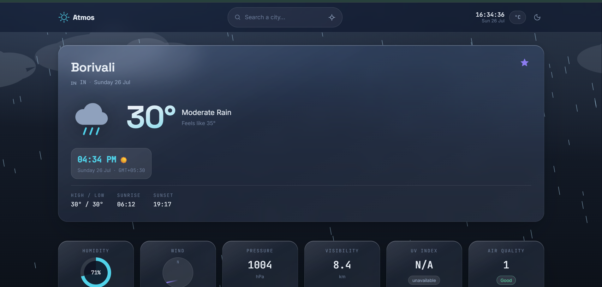
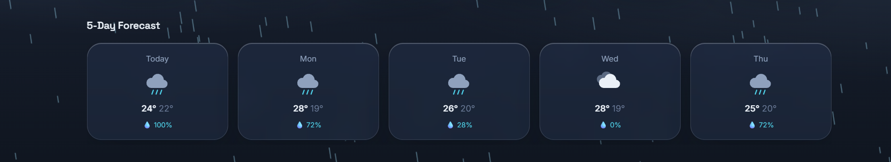
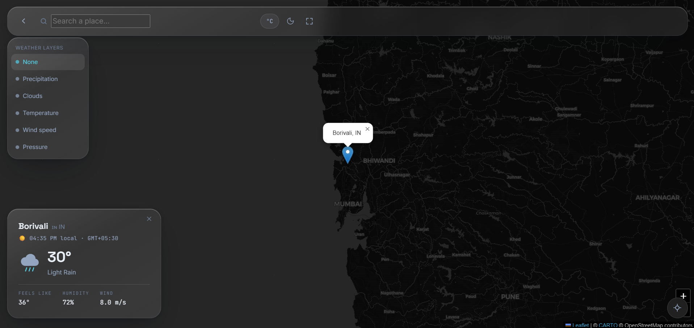
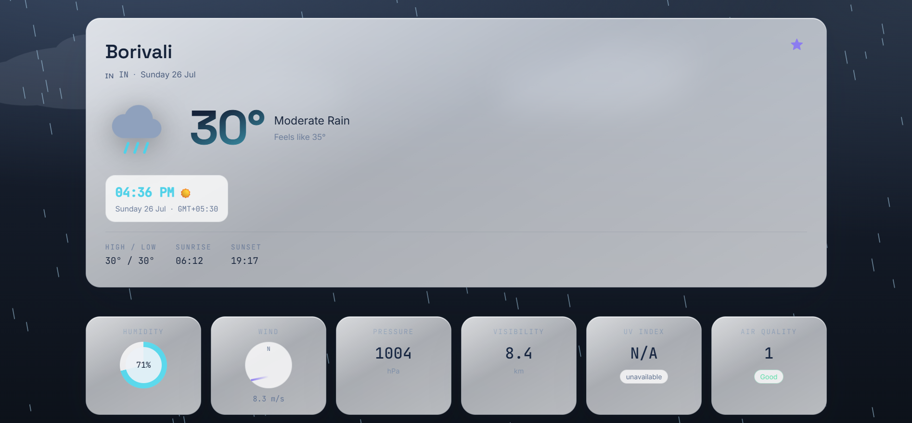

# 🌦️ Atmos — Full Stack Weather Dashboard

A modern **Full Stack Weather Dashboard** built with **HTML5, CSS3, JavaScript (ES6), Node.js, Express.js, MongoDB, Leaflet.js, and the OpenWeather API**.

The application provides real-time weather updates, interactive weather maps, air quality information, UV index, favourites, search history, and dynamic weather animations through a clean, responsive glassmorphism interface.The application is fully responsive and designed to provide a smooth user experience across desktop and mobile devices.

---

## 🚀 Live Demo

🌐 **Coming Soon**

> The application will be deployed on Render.

---

## 📂 GitHub Repository

**Repository:**  
https://github.com/prananshetty0-arch/atmos-weather-dashboard

---

# 📸 Project Screenshots

## 🏠 Home Dashboard



---

## 📅 5-Day Forecast



---

## 🗺️ Interactive Weather Map



---

## 🌙 Light Mode



---

# ✨ Features

## 🌦️ Real-Time Weather

- Search weather by city name
- Current location weather using GPS
- Live temperature updates
- Feels Like temperature
- Weather description
- Humidity
- Atmospheric pressure
- Visibility
- Wind speed & direction
- Cloud coverage
- Sunrise & sunset timings
- Local date & time

---
# 💡 Key Highlights

- 🌍 Real-time weather updates using OpenWeather API
- 🗺 Interactive weather map powered by Leaflet.js
- 📍 GPS-based current location detection
- 🔍 Smart city search with autocomplete
- 🌦 Dynamic weather animations based on live conditions
- ❤️ Favourite cities stored in MongoDB
- 📜 Search history with persistent storage
- 🌙 Dark & Light theme support
- 📱 Fully responsive design

---

## 📅 Weather Forecast

- 5-Day weather forecast
- Daily minimum & maximum temperature
- Chance of precipitation
- Dynamic weather icons

---

## 🌍 Air Quality & UV Index

- Air Quality Index (AQI)
- Pollutant information
- UV Index
- Weather condition indicators

---

## 🗺️ Interactive Weather Map

Built using **Leaflet.js**

Features include:

- Interactive map
- Automatic marker placement
- Current city popup
- Live precipitation overlay
- Current location support
- Full-screen map view

---

## 🔍 Smart Search

- City search
- Live autocomplete suggestions
- Debounced search
- Keyboard navigation
- Accurate city selection
- Invalid search feedback

---

## ❤️ Personalization

- Save favourite cities
- Recent search history
- MongoDB database storage
- Dark / Light mode
- Celsius / Fahrenheit toggle
- Live digital clock

---

## 🎨 Modern User Interface

- Glassmorphism design
- Animated sky
- Rain animation
- Snow animation
- Clouds
- Fog
- Lightning
- Night stars
- Smooth animations
- Responsive layout
- Keyboard accessibility

---
# 🎯 Skills Demonstrated

- REST API Development
- Full Stack Web Development
- API Integration
- MongoDB Database Design
- Responsive Web Design
- Modern JavaScript (ES6 Modules)
- Express.js Backend Development
- Error Handling
- UI/UX Design
- Git & GitHub

---

# 🛠️ Tech Stack

## Frontend

- HTML5
- CSS3
- JavaScript (ES6 Modules)
- Canvas API
- Leaflet.js

---

## Backend

- Node.js
- Express.js

---

## Database

- MongoDB
- Mongoose

---

## APIs

- OpenWeather API

---

# 🏗️ Project Architecture

```
                Frontend
     (HTML • CSS • JavaScript)
                │
                ▼
        Express.js REST API
                │
                ▼
          MongoDB Database
                │
                ▼
        OpenWeather API
```

---

# 📁 Project Structure

```text
weather-dashboard/
│
├── backend/
│   ├── config/
│   │   └── db.js
│   │
│   ├── controllers/
│   │   ├── weatherController.js
│   │   ├── favoriteController.js
│   │   └── historyController.js
│   │
│   ├── middleware/
│   │   ├── errorHandler.js
│   │   ├── rateLimiter.js
│   │   └── validators.js
│   │
│   ├── models/
│   │   ├── Favorite.js
│   │   └── Search.js
│   │
│   ├── routes/
│   │   ├── weatherRoutes.js
│   │   ├── favoriteRoutes.js
│   │   └── historyRoutes.js
│   │
│   ├── utils/
│   ├── ApiError.js
│   ├── asyncHandler.js
│   ├── formatTime.js
│   └── openWeatherClient.js
│   │
│   ├── .env.example
│   ├── package.json
│   ├── package-lock.json
│   └── server.js
│
├── frontend/
│   ├── assets/
│   │   ├── favicon.svg
│   │   └── screenshots/
│   │       ├── home.png
│   │       ├── forecast.png
│   │       ├── map.png
│   │       └── light-mode.png
│   │
│   ├── css/
│   ├── js/
│   ├── index.html
│   └── map.html
│
├── README.md
└── .gitignore
```

---

# ⚙️ Installation

## 1. Clone the Repository

```bash
git clone https://github.com/prananshetty0-arch/atmos-weather-dashboard.git
```

---

## 2. Navigate to the Backend

```bash
cd backend
```

---

## 3. Install Dependencies

```bash
npm install
```

---

## 4. Configure Environment Variables

Create a **.env** file inside the **backend** folder.

```env
WEATHER_API_KEY=YOUR_OPENWEATHER_API_KEY
MONGO_URI=mongodb://127.0.0.1:27017/atmos
PORT=5000
CLIENT_ORIGIN=http://localhost:5000
```

---

## 5. Start the Development Server

```bash
npm run dev
```

---

## 6. Open the Application

```
http://localhost:5000
```

---

# 📡 API Endpoints

| Method | Endpoint | Description |
|---------|----------|-------------|
| GET | `/api/weather` | Current Weather |
| GET | `/api/forecast` | 5-Day Forecast |
| GET | `/api/airquality` | Air Quality Index |
| GET | `/api/uv` | UV Index |
| GET | `/api/geocode` | City Autocomplete |
| GET | `/api/reverse-geocode` | Reverse Geocoding |
| GET | `/api/history` | Search History |
| DELETE | `/api/history/:id` | Delete History Entry |
| DELETE | `/api/history` | Clear Search History |
| GET | `/api/favorites` | Get Favourite Cities |
| POST | `/api/favorites` | Add Favourite City |
| DELETE | `/api/favorites/:id` | Remove Favourite City |

---

# 🔒 Security Features

- Environment Variables
- Helmet.js Security
- CORS Protection
- Rate Limiting
- Request Validation
- MongoDB Injection Protection
- Centralised Error Handling

---

# 🚀 Future Improvements

- Hourly Weather Forecast
- Weather Alerts
- User Authentication
- Progressive Web App (PWA)
- Offline Support
- Multi-City Comparison
- Docker Support
- Automated Testing

---

# 👨‍💻 Author

**Pranan Shetty**

🎓 B.Sc. Information Technology Student

💻 Aspiring Full Stack Developer

GitHub:  
https://github.com/prananshetty0-arch

---

# 📄 License

This project is licensed under the **MIT License**.

You are free to use, modify, and distribute this project for learning, educational, and portfolio purposes.

---

⭐ **If you found this project helpful, please consider giving it a Star on GitHub!**